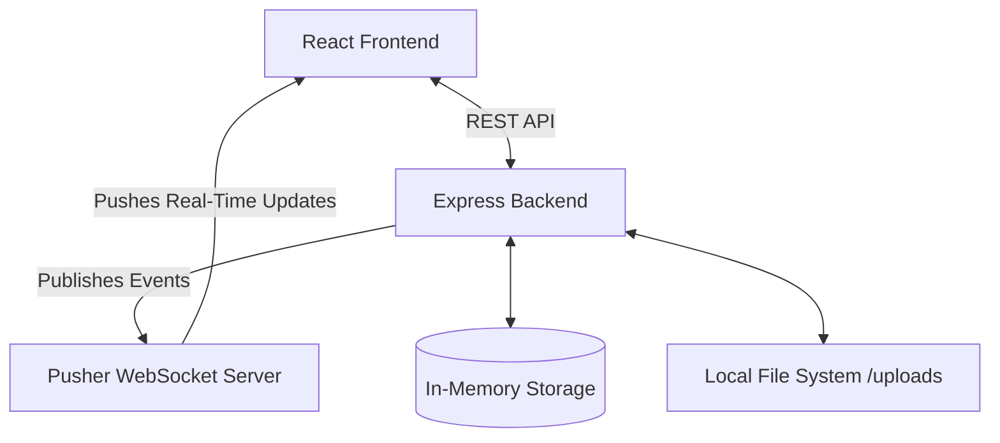
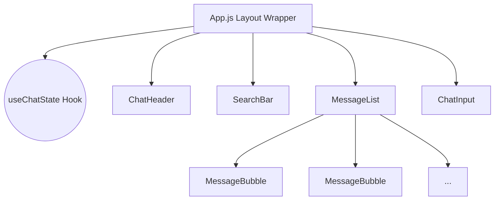
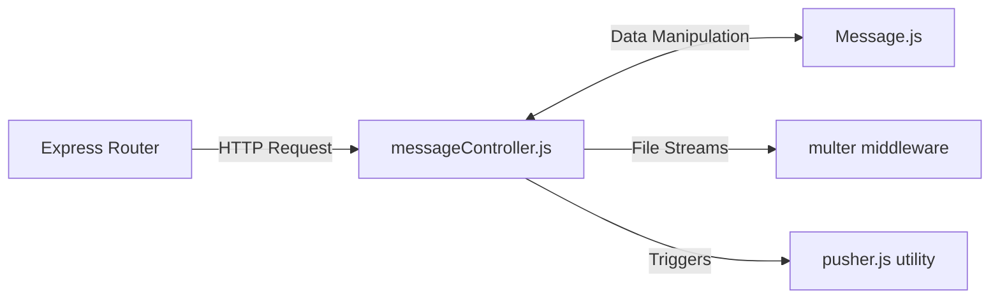
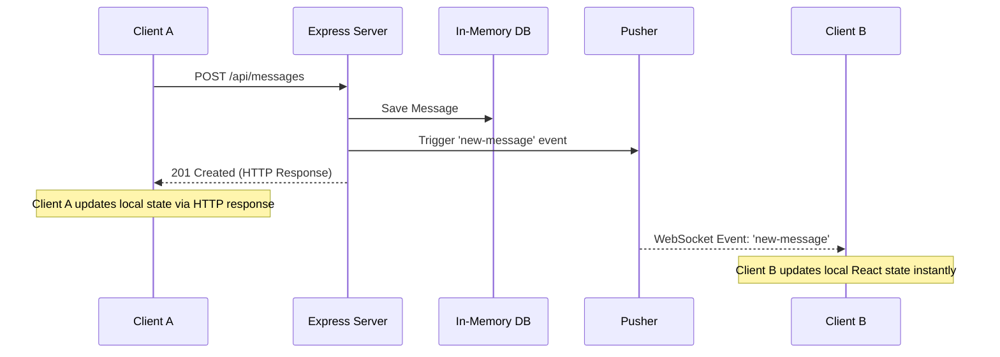

# 💬 Real-Time Chat Application

A production-grade, real-time messaging application built with **React**, **Node.js**, **Express**, and **Pusher**. This project features a stunning glassmorphic UI, robust server-side search, media sharing capabilities, and a scalable Component/MVC architecture.

> [!TIP]
> This application demonstrates advanced frontend state orchestration and a decoupled backend architecture, making it highly scalable and easy to maintain.

---

## ✨ Key Features

- **Real-Time Synchronization**: Instantaneous message broadcasting using Pusher WebSockets.
- **Debounced Server-Side Search**: Highly optimized search functionality that queries the backend without overwhelming the API during rapid typing.
- **Media Uploads**: Seamless image sharing using `multer` for multipart/form-data processing.
- **Intelligent Chat UI**: iMessage-style dynamic chat bubbles that align automatically based on the sender's username.
- **Premium Aesthetics**: A custom-designed, responsive, glassmorphic UI built from the ground up with pure CSS and modern typography (Inter).
- **Fault-Tolerant Engine**: Graceful degradation if Pusher credentials are omitted; the app falls back to standard HTTP polling/refresh seamlessly.

---

## 🏛 System Architecture

The application is split into two independent nodes: a React Client and an Express API. They communicate via REST for data operations and Pusher for real-time pub/sub events.



---

## 💻 Frontend Architecture

The frontend (`/app`) is designed using a strict **Component & Service Pattern** to ensure high cohesion and low coupling.

### Component Tree
We eliminated monolithic components in favor of a declarative, modular layout. 



### State Management & Services
- **`services/api.js`**: An Axios-based HTTP client that centralizes all network logic. Components never call `axios` directly.
- **`hooks/useChatState.js`**: The master orchestrator. It holds the core state (`messages`, `loading`), integrates with the API service to fetch data, and binds the Pusher event listeners to update the UI instantly when remote events occur.

---

## ⚙️ Backend Architecture (MVC)

The backend (`/api`) utilizes the **Model-View-Controller (MVC)** pattern to cleanly separate routing from business logic.



### API Endpoints

| Method | Endpoint | Description |
| :--- | :--- | :--- |
| `GET` | `/api/messages` | Retrieves paginated chat history. |
| `GET` | `/api/messages/search?q=` | Server-side text search for messages. |
| `POST` | `/api/messages` | Creates a standard text message. |
| `POST` | `/api/messages/with-image` | Multipart upload for text + image. |
| `DELETE`| `/api/messages/:id` | Deletes a message by ID. |

---

## 🔄 Real-Time Synchronization Lifecycle

The real-time engine ensures that when one client performs an action, all other connected clients reflect that action immediately without needing to refresh.



> [!WARNING]
> **Race Condition Prevention**
> If a user is actively typing in the `SearchBar`, the frontend intelligent hook (`useChatState`) intercepts incoming Pusher events and prevents them from polluting the user's specific search results.

---

## 🚀 Development & Setup

### Prerequisites
- Node.js (v14+)
- npm or yarn
- A free [Pusher](https://pusher.com/) account (optional, but required for real-time functionality).

### 1. Backend Setup
1. Navigate to the `api` directory: `cd api`
2. Install dependencies: `npm install`
3. Create a `.env` file based on the example:
   ```env
   PORT=3001
   PUSHER_APP_ID=your_app_id
   PUSHER_KEY=your_key
   PUSHER_SECRET=your_secret
   PUSHER_CLUSTER=your_cluster
   ```
4. Start the development server: `npm run dev`

### 2. Frontend Setup
1. Navigate to the `app` directory: `cd app`
2. Install dependencies: `npm install`
3. Create a `.env` file based on the example:
   ```env
   REACT_APP_API_URL=http://localhost:3001
   REACT_APP_PUSHER_KEY=your_key
   REACT_APP_PUSHER_CLUSTER=your_cluster
   ```
4. Start the React development server: `npm start`

> [!IMPORTANT]
> The React app runs on `http://localhost:3000` and automatically proxies requests to the backend API running on `http://localhost:3001`. Ensure both are running concurrently.
